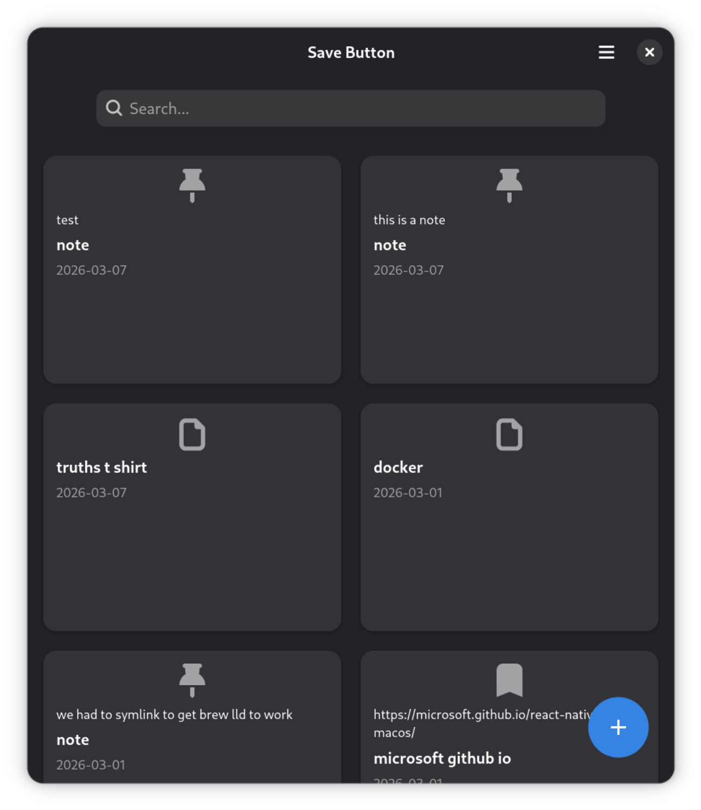

# Kaya

Kaya is a local-first bookmarking system. Sort of. It might be described as the most insanely oversimplified bookmarking system in existence.



## TODO

* [x] attempt throw-away WPF port of existing GTK app
* [x] add features from mobile app: search, preview, etc.
* [x] turn `.gitlab-ci.yml` into GitHub Actions
* [x] spike native host <=> WXT local sync
* [x] fix MacOS bugs (About window)
* [x] MacOS build - GHA
* [x] full WPF port
* [x] Windows build - GHA

## Architecture

The Kaya architecture is defined in Architectural Decision Records, or ADRs. You can find a chronological list of ADRs in [doc/arch](doc/arch).

### Data Model

The local disk is the only source of truth. Kaya's records ("anga") are stored in the following layout:

* `~/.kaya/anga` = bookmarks, notes, PDFs, images, and other files (manual data)
* `~/.kaya/meta` = tags and metadata for anga records (manual data)
* `~/.kaya/words` = words extracted by Kaya Server for full-text search (generated data)

## Setting Up Your Development Environment

### Prerequisites: TypeScript & `gi-types`

```bash
npm install -g typescript
make setup # from the root of the repo
```

### Zed

If you want to be a little more bleeding edge, you can install [Zed](https://zed.dev/). It's also well-supported for JavaScript
and TypeScript development but does not support Flatpak.

* _TypeScript, ESLint, and Prettier support is built into Zed_
* [Additional ESLint instructions](https://github.com/zed-industries/zed/discussions/35888) and [format-on-save instructions](https://github.com/zed-industries/zed/discussions/13602)
* XML by `sweetppro`
* Meson by Hanna Rose
* As of this writing, Zed has no Flatpak extension

### Flatpak

You will also need to install the GNOME Nightly flatpak SDK and the Node and Typescript
SDK extensions. First, add the flatpak repositories if you have not already configured them.
(Beta is optional.) In a terminal, run:

```
$ flatpak remote-add --user --if-not-exists flathub https://flathub.org/repo/flathub.flatpakrepo
$ flatpak remote-add --user --if-not-exists flathub-beta https://flathub.org/beta-repo/flathub-beta.flatpakrepo
$ flatpak remote-add --user --if-not-exists gnome-nightly https://nightly.gnome.org/gnome-nightly.flatpakrepo
```

Then install the SDKs and extensions:

```
$ flatpak --user install org.gnome.Sdk//master org.gnome.Platform//master
$ flatpak --user install org.freedesktop.Sdk.Extension.node24//25.08 org.freedesktop.Sdk.Extension.typescript//25.08 org.freedesktop.Sdk.Extension.rust-stable//25.08
```

Also ensure that you have `flatpak-builder` installed:

```
$ sudo apt install flatpak-builder         # or whatever is appropriate on your distro
```

### Flathub

Install the stable platform and SDK:

```
$ flatpak install -y flathub org.flatpak.Builder
$ flatpak --user install org.gnome.Sdk//48 org.gnome.Platform//48
```

### Node Package Manager & ESLint

This step is optional, but highly recommended for setting up linting and code formatting.
Install `npm`, then run `npm install` in your project directory.

## Building & Running

### Prerequisites

Initialize the submodule with TypeScript definitions ( `gi-types`):

```
$ make setup # from the root, above ./gtk
$ pip install meson
$ yarn install
```

### Flatpak Build

To build and run the application, run:

```
$ make build
$ make install
$ make run
```

### macOS Build

To build and run on macOS, first install dependencies via Homebrew:

```
$ make macos-deps
```

Then build the `.app` bundle and run it:

```
$ make macos-build
$ make macos-run
```

To create a `.dmg` installer:

```
$ make macos-dmg
```

### Releasing

Run `ruby bin/release.rb` to cut a new version. The script bumps versions, commits, tags, and pushes.

The arm64 macOS DMG is built automatically by GitHub Actions. The Intel (x86_64) DMG must be built locally on an Intel Mac because GitHub's x64 macOS runners are paid. If `release.rb` detects macOS, it runs the Intel build automatically. On Linux, it prints instructions:

```
cd /path/to/savebutton-gtk
git pull
ruby bin/release-macos-intel.rb
```

See [doc/distros/DISTROS.md](doc/distros/DISTROS.md) for full release procedures.

## Dev Process

When adding or renaming files, remember to include changes in these locations:

* `gtk/src/{filename}.ts`
* `gtk/src/meson.build` — add/update the entry in the `sources` list
* `gtk/src/org.savebutton.SaveButton.src.gresource.xml` — add/update the `<file>` entry

## License

[`AGPL-3.0-only`](./LICENSE)
